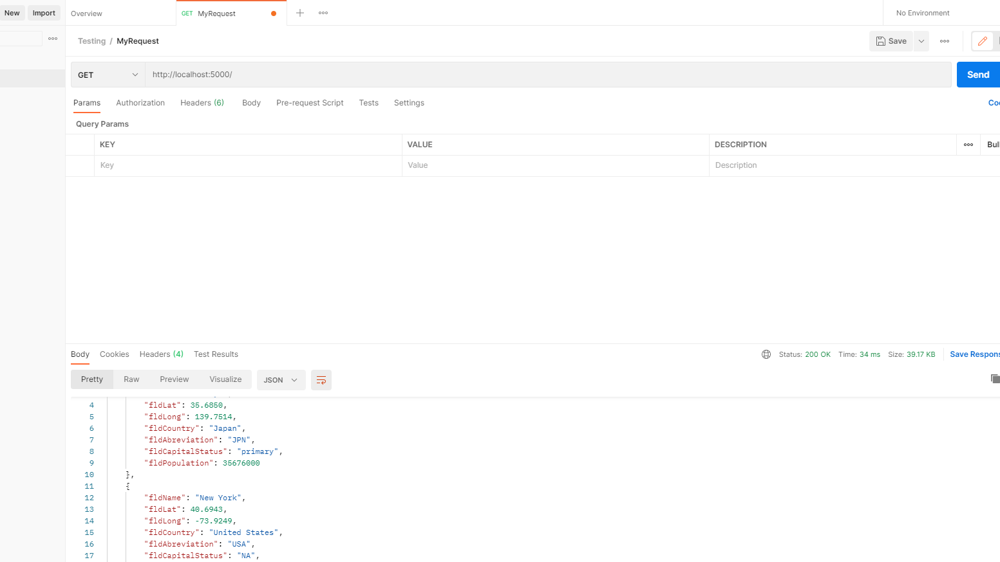
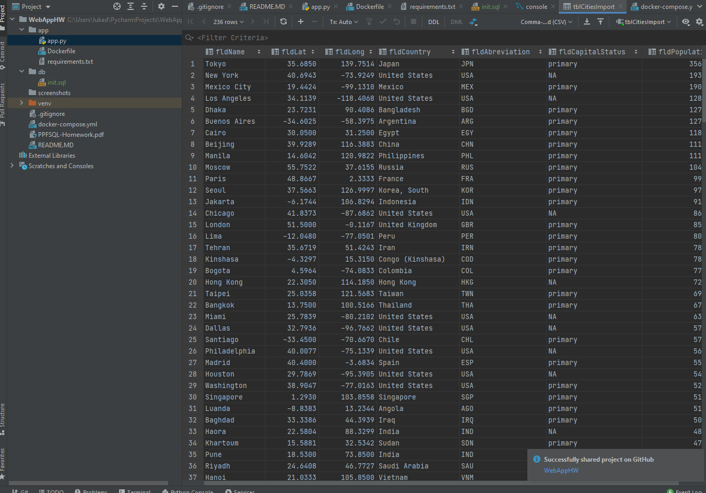
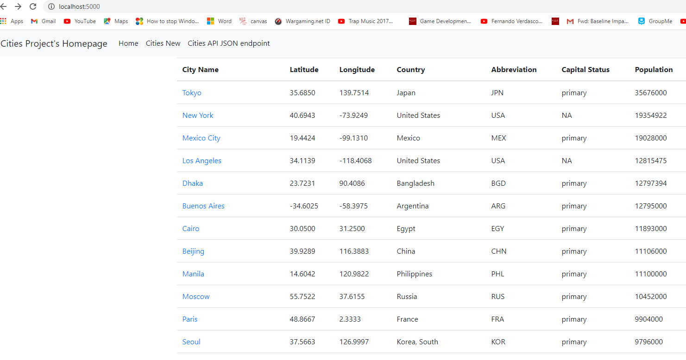
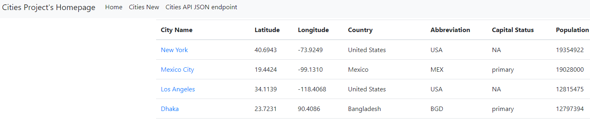
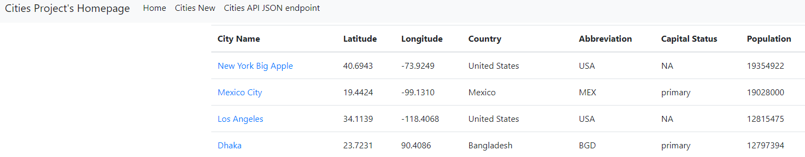

# Project Description
This project is a homework assignment to teach how to get Pycharm setup with Docker, Flask, MySQL, and Postman

# Postman Screenshot

# Functional Table on Web

# Functional Table on Web

# Deleted row in Table on Web

# Edited Row in Table on Web
